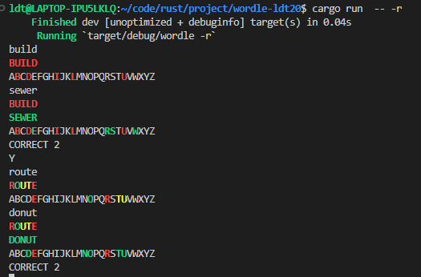
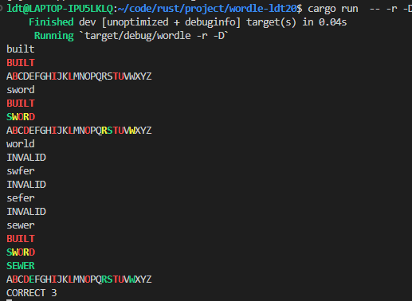

# 大作业：Wordle
#### 李栋庭 2020011222 无16
## 简单的程序结构和说明
### 文件结构
* `main.rs`
    * `main` 函数：
        * `is_tty` 变量：判断当前是交互模式或者测试模式
        * `cli` 变量：`Cli` 类型，用于处理命令行参数，并给出各种对应的控制信号
        * `player` 变量：`Player` 类型，用于记录玩家在游戏中的各种输入和统计信息
        * `server` 变量：`Server` 类型，处理候选词库和可用词库，并给出可猜测词和其他相关信息
        * 函数主要逻辑为：  
        首先对 `cli`，`player`，`server` 预处理；然后在循环中由`server`生成 `answer`, 进入 `play_game` 函数，`player` 完成状态写入并判断是否开始下一局游戏。

    * `play_game` 函数：
        * `guess_words` 变量：记录一局游戏中，所有猜测的单词
        * `word_states` 变量：记录一局游戏中，所有猜测的单词与答案匹配的结果
        * `alphabet_state` 变量：记录一局游戏中，所有字母的状态
        * 函数主要逻辑为：  
        首先初始化各种变量；然后在最多 6 次循环中输入单词，判断是否合法，若合法，进入 `compare_secret_guess` 函数匹配，根据匹配结果打印单词状态和所有字母状态（根据`is_tty` 打印格式不同），若完全匹配退出游戏，否则进入下一轮循环；若输入单词不合法，打印 *INVALID*。

    * `compare_secret_guess` 函数：
        * 函数主要逻辑为：  
        通过 `get_word_state` 函数匹配 `secret_word` 和 `guess_word` 得到 `word_state`，然后根据 `word_state` 更新 `alphabet_state`。

    * `get_word_state` 函数：
        * `secret_guess` 变量：`HashMap` 类型，记录已经匹配好的字母
        * 函数主要逻辑为：  
        先匹配位置相同的字母，并建立映射关系，然后匹配位置不同的字母，并建立映射关系。

    * `print_` 开头的函数：
        * 主要根据状态不同来打印字母

* `cli.rs`
    * `Cli` 结构体：
        * field：`word`, `random`, `difficult`, `stats`, `day`, `seed`, `final_set`, `acceptable_set`, `state`, `config`, `prompt`
        * impl：`mix_with_config`, `check_conflict`
        * `mix_with_config` 函数：  
        结合命令行参数与配置文件共同给出控制信号，如果同时在配置文件和命令行参数中指定了同一个参数，则以后者为准。
        * `check_confilct` 函数：  
        判断命令行参数之间是否有冲突，若有冲突 `return Err("message".into())`
    * `Config` 结构体：
        * 在验收之后添加的，用于读取 config 文件。
        * field 基本与 `Cli` 相同，不过将 `random`, `difficult`, `stats` 由 `bool` 类型改为 `Option<bool>` 类型。

* `player.rs`
    * `ModeState` 结构体：
        * field：`total_rounds`, `games`
        * `games` 为 `Vec<Game>` 类型，用于读入 json 文件，此外设置 field 为 `#[serde(default)]`, 可以略过缺失信息。
    * `Game` 结构体：
        * field：`answer`, `guesses`
    * `Player` 结构体：
        * field：`total_rounds`, `win_rounds`, `win_guess_times`, `hot_words`, `games`
        * impl：`read_state_before`, `write_state_after`, `average_times`, `get_sorted_hot_words`, `have_next_game`
        * `have_next_game` 函数：  
        根据输入字母为 Y/N，给出 bool 变量，如果 `cli.stats` 为 `true`，打印统计信息。
        * `read_state_before` 函数：  
        读取存储状态的 json 文件，并更新 `player` 存储的数据。
        * `write_state_after` 函数：  
        将 `player` 存储的统计信息写入状态文件。
        * `average_times` 函数：  
        计算成功游戏的平均猜测次数，并返回。
        * `get_sorted_hot_words`：  
        将使用过的猜测词进行排序。

* `server.rs`
    * `Server` 结构体
        * field：`answer`, `final_words`, `acceptable_words`, `rounds`, `possible_answer`, `entropy_count`
        * impl：`word_list_process`, `init_secret_word`, `is_valid`, `get_all_possible_answers`, `recommend_n_possible_answers`, `compute_entropy_for_one`, 
        * `word_list_process` 函数：   
            根据 `cli` 决定 `final_words`, `acceptable_words`，然后对两个词库进行检查，并使用随机数打乱 `final_words`。
        * `init_secret_word` 函数：  
            根据 `cli` 决定当前是随机模式还是指定答案模式，然后给出 `answer`。
        * `is_valid` 函数：
            判断猜测单词是否合法
        * 其他函数在提高模式里面介绍

    * `word_basic_check` 函数：
        * 仅用于判断字符串内容是否由 5 个字母组成。
    * `word_hard_check` 函数：
        * 困难模式下的字母检查，判断单词是否满足困难模式的要求。
    * `word_perfect_check` 函数：
        * 完美检查，判断是否利用了之前猜测单词状态的所有信息。

* `builtin_words.rs`
    * `FINAL`：内置候选词库
    * `ACCEPTABLE`：内置可猜测词库


## 游戏主要功能说明和截图
### 指定答案模式

程序启动时，从标准输入读取一个词作为答案，开始一局游戏（一局游戏最多 6 次猜测）  
* 在命令行中输入：
    ```
    cargo run -- -w <word>
    ```
    `<word>` 为指定答案
* 例子：  

* 若不指定单词也不指定随机模式，默认是指定答案模式，但是需要每轮都先输入答案，再猜测单词，每次猜测完成之后，输入 `Y` 可以开始下一局：  


  
### 随机模式：
程序启动时，从候选词库中随机读取一个词作为答案，开始一局游戏，你也可以增加命令行参数 `-d/--day` 用于指定开始时的局数，`-s/--seed` 用于指定随机种子。
* 在命令行中输入：
  ```
  cargo run -- -r
  cargo run -- -r -d <day> -s <seed>
  ```
  `<day>` 指定开始时的局数, `-d 5` 表示跳过前四局，从第五局开始，默认值是 1。  
  `<seed>` 指定随机种子，默认值是 42.
* 例子：  

### 困难模式：
在此模式下，新的猜测中所有已知位置正确（绿色，即 G）的字母不能改变位置，也必须用到所有存在但位置不正确（黄色，即 Y）的字母，但是允许在新的猜测中重复使用数量过多（红色，即 R）的字母，也允许存在但位置不正确（黄色，即 Y ）的字母再次出现在相同的错误位置。
* 在命令行中输入：
   ```
   cargo run -- -r -D
   ```
* 例子：  
  

### 词库指定
增加命令行参数 `-f/--final-set` 以及 `-a/--acceptable-set` 用于指定候选词库和可用词库文件（如 `-f final.txt -a acceptable.txt`）。如果不指定，则使用内置的词库。
* 在命令行中输入：
  ```
  cargo run  -- -r -f data/final.txt -a data/acceptable.txt
  ```
* 例子：  
  
### 状态保存和统计信息
增加命令行参数 `-S/--state` 用于保存和加载随机模式的游戏状态，增加命令行参数 `-t/--stats` 表示在每局后，统计并输出截至目前的游戏成功率（成功局数 / 已玩局数）、平均尝试次数（仅计算成功的游戏，如果没有成功的游戏则为 0）、所有猜测中（按次数降序和字典序升序排序）最频繁使用的五个词和次数。
* 在命令行输入：
```
cargo run -- -S state.json -t -r
```
* 例子：  
  
  

### 配置文件
增加命令行参数 `-c/--config` 用于指定启动配置文件（如 `-c config.json`）
* 在命令行输入：
```
cargo run -- -c config.json
```
* 例子：  
  
  

### 说明
事实上，这些命令行参数组合可以随意搭配，但是部分参数之间会有冲突：
* 随机模式下不允许使用 `-w/--word` 参数
* 指定答案模式下不允许使用 `-d/--day` 和 `-s/--seed` 参数
* 如果同时在配置文件和命令行参数中指定了同一个参数，则以后者为准，相当于配置文件设定了默认的命令行参数。

## 提高要求的实现方式
### 单步最优
* 基于现有的猜测结果给出提示，即根据用户提供的所有的已用过的字母和状态（或者游戏的当前状态），从可用词列表（ACCEPTABLE）中筛选出所有可能的答案
  * 在 `server.rs` 文件的 `Server` 结构体中增加`get_all_possible_answers`函数，函数主要逻辑为：  
    对 `acceptable_words` 所有单词进行 `word_perfect_check`，所有通过的单词即 `possible_answers`，并返回。
* 在这些剩余可用词的基础上，给出若干个推荐词，只考虑单步最优，给每个词打分，选出最高的几个，计算信息熵并排序；
  * 在 `server.rs` 文件的 `Server` 结构体中增加`compute_entropy_for_one`函数，其主要逻辑为：  
    通过 `get_word_state` 函数得到该单词与所有剩余可用词匹配状态 `match_word_states`，然后根据不同状态聚类得到各种状态占比(概率) `state_possiblities` ，根据信息熵公式
     $$E(x) = -\Sigma p(x)log(p(x))$$
     计算出单个单词的信息熵，这里使用了`reyon`库加速运算。

  * 在 `server.rs` 文件的 `Server` 结构体中增加`recommend_n_possible_answers`函数，其主要逻辑为： 
    通过 `compute_entropy_for_one` 函数得到所有单词及其信息熵`recommend_words_vec`，这里使用了`reyon`库加速运算。然后对其排序，打印出前 n 个单词和信息熵。

在命令行输入：
```
cargo run -- -c config -p 5
```
例子：

### 基于 TUI 绘制用户界面
文件地址：<https://git.tsinghua.edu.cn/ldt20/wordle>

主要改变了 `main.rs` 文件，将原来文件的 `main` 函数改为 `main_logic` 函数，在原有的 `main` 函数中增加 `tui` 的命令，

* `App` 结构体：
  * field：`guess_words`, `word_states`, `message`, `alpha_states`
  * 该结构体作为 `ui` 函数信息区，输入区，键盘区的文本来源。
* `main_logic` 函数： 
  * 新增 `app` 变量
    * 使用 `terminal.draw(|f| ui(f, &mut app))?;` 画 ui 界面
  * 在各个函数中增加 `&mut app` ，使用 `terminal.draw(|f| ui(f, &mut app))?;` 来代替输入和输出。
* `ui` 函数：
  * `chunks` 变量：
    *  按照 6 行，8 行 和 最小 5 行的规则分割区域，分别作为信息区，输入区，键盘区
   * 画出信息区，输入区，键盘区，并利用 `app` 及时更新画面。

在命令行输入：
```
cargo run -- -c config.json 
```
初始化：

输入一个单词：

完成一局游戏：

## 完成此作业感想
* 助教提供的作业要求很全面，基本照着文档写没有什么大问题。
* 最后验收是否发现自己还是有很多地方没有考虑到，需要改进。
* rust 有很多库很方便，自己造轮子 bug 特别多，效果还不如直接调库。